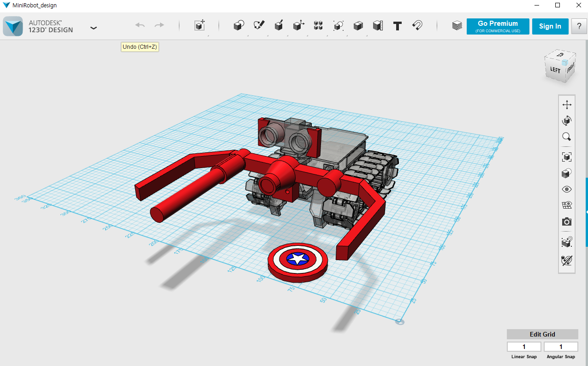
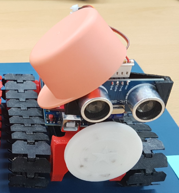

# Arduino_MINIRobot Project

## Tool

- Design : Autodesk 123D_Design
- Program : Ardunio

## Explanation

The project produced a work with a simple direction of movement and rotation.

The project has two modes, manual and automatic movement.

In the auto move mode, it moves automatically using the ultra sensor and stepper motor.

### IMAGE

The design was printed using 3D printing after using 123D_Design.

The battery used a lithium battery and The control was operated by a phone with Bluetooth.

T